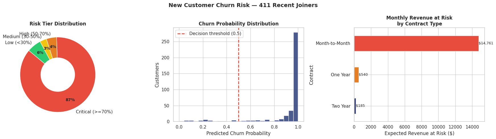

# Telecom Customer Churn Prediction

**SQL Server → Power BI → Machine Learning** — a three-phase end-to-end data project

---

## Overview

Telecom companies lose significant revenue each month to preventable churn. This project builds a full data pipeline to identify at-risk customers *before* they leave — starting with SQL data engineering, surfacing patterns through Power BI, and finally training a machine learning model that scores every incoming customer with a churn probability.

The three phases intentionally mirror how this would work inside a real organisation: data engineering shapes the raw data, business intelligence reveals the patterns, and machine learning operationalises those patterns into predictions.

**Best model: XGBoost — ROC-AUC 0.887 | Accuracy 84.5%**  
**411 new customers scored — $15,486 monthly revenue at risk identified**

---

## Files

```
telecom-churn-prediction/
│
├── data/
│   └── prediction_data.xlsx              # Two SQL views exported to Excel
│                                         #   vw_ChurnData — 6,007 labelled customers
│                                         #   vw_JoinData  — 411 new customers to score
│
├── powerbi/
│   └── Churn_Analysis.pbix               # Power BI dashboard (2 pages)
│
├── notebooks/
│   └── telecom_customer_churn_analysis.ipynb
│
└── outputs/
    ├── 1_eda_powerbi_validated.png
    ├── 2_model_evaluation.png
    ├── 3_shap_explainability.png
    ├── 4_business_insights.png
    └── 5_churn_predictions.xlsx
```

---

## Phase 1 — Data Engineering (SQL Server)

Raw customer data was stored across relational tables in SQL Server Management Studio. Two views were written to clean and shape the data into a consistent schema used by both Power BI and the ML pipeline.

```sql
-- Historical customers with known churn outcomes (training + Power BI)
CREATE VIEW vw_ChurnData AS
SELECT
    c.Customer_ID,
    c.Gender, c.Age, c.Married, c.State,
    c.Number_of_Referrals,
    c.Tenure_in_Months,
    ISNULL(c.Value_Deal, 'None')            AS Value_Deal,
    c.Phone_Service,
    ISNULL(c.Multiple_Lines, 'No')          AS Multiple_Lines,
    c.Internet_Service,
    ISNULL(c.Internet_Type, 'None')         AS Internet_Type,
    ISNULL(c.Online_Security, 'No')         AS Online_Security,
    ISNULL(c.Online_Backup, 'No')           AS Online_Backup,
    ISNULL(c.Device_Protection_Plan, 'No')  AS Device_Protection_Plan,
    ISNULL(c.Premium_Support, 'No')         AS Premium_Support,
    ISNULL(c.Streaming_TV, 'No')            AS Streaming_TV,
    ISNULL(c.Streaming_Movies, 'No')        AS Streaming_Movies,
    ISNULL(c.Streaming_Music, 'No')         AS Streaming_Music,
    ISNULL(c.Unlimited_Data, 'No')          AS Unlimited_Data,
    c.Contract, c.Paperless_Billing, c.Payment_Method,
    CAST(c.Monthly_Charge AS DECIMAL(10,2))              AS Monthly_Charge,
    CAST(c.Total_Charges AS DECIMAL(10,2))               AS Total_Charges,
    CAST(c.Total_Refunds AS DECIMAL(10,2))               AS Total_Refunds,
    CAST(c.Total_Extra_Data_Charges AS INT)              AS Total_Extra_Data_Charges,
    CAST(c.Total_Long_Distance_Charges AS DECIMAL(10,2)) AS Total_Long_Distance_Charges,
    CAST(c.Total_Revenue AS DECIMAL(10,2))               AS Total_Revenue,
    s.Customer_Status,
    ISNULL(s.Churn_Category, 'Others')  AS Churn_Category,
    ISNULL(s.Churn_Reason, 'Others')    AS Churn_Reason
FROM prod_Churn c
LEFT JOIN prod_Services s ON c.Customer_ID = s.Customer_ID
WHERE s.Customer_Status IN ('Churned', 'Stayed');

-- New customers with no outcome label yet (scoring)
CREATE VIEW vw_JoinData AS
SELECT /* same columns */
FROM prod_Churn c
LEFT JOIN prod_Services s ON c.Customer_ID = s.Customer_ID
WHERE s.Customer_Status = 'Joined';
```

Key decisions made at the SQL layer:
- `ISNULL` applied to all service columns — a missing value genuinely means "not subscribed", not a data error
- Explicit `CAST` to `DECIMAL(10,2)` on financial columns prevents silent type coercion downstream
- Both views share the same column schema, so the ML pipeline applies identically to both

---

## Phase 2 — Business Intelligence (Power BI)

The Power BI dashboard was built before any modelling to understand the data visually. The findings from this phase directly shaped every feature engineering and modelling decision in Phase 3.

### Summary Page

The Summary page contains 15 visuals: 4 KPI cards, 8 charts, 1 pivot table, and 2 slicers.

| Visual | Type | Finding |
|--------|------|---------|
| Total Customers | KPI card | 6,007 |
| New Joiners | KPI card | 411 |
| Total Churn | KPI card | 1,732 |
| Churn Rate | KPI card | **28.8%** |
| Contract vs Churn Rate | Bar chart | Month-to-Month **52.4%** vs One Year 11.2% vs Two Year 2.8% |
| Internet Type vs Churn Rate | Bar chart | Fiber Optic **42.5%** vs Cable 27.6% vs DSL 20.8% |
| Tenure Groups vs Churn | Combo chart | Consistent churn across all tenure bands |
| Age Groups vs Churn Rate | Combo chart | Slight increase in churn for older age groups |
| Churn Category | Bar chart | Competitor (761), Attitude (301), Dissatisfaction (300), Price (196) |
| State vs Churn Rate | Bar chart | Geographic variation across US states |
| Payment Method vs Churn Rate | Bar chart | Variation by payment channel |
| Gender vs Total Churn | Donut chart | Roughly equal split |
| Services pivot table | Matrix | Customers without Online Security/Backup show higher churn % |
| Monthly Charge Range | Slicer | Filters all visuals |
| Married | Slicer | Filters all visuals |

### Churn Reason Page

| Category | Count |
|----------|-------|
| Competitor | 761 |
| Attitude | 301 |
| Dissatisfaction | 300 |
| Price | 196 |
| Other | 174 |

> **Important:** `Churn_Category` and `Churn_Reason` are used here for historical insight only. They are **dropped entirely from the ML model** — these fields only exist *after* a customer has already churned. Using them as features would be data leakage.

---

## Phase 3 — Machine Learning

### Dataset

| | Count |
|--|--|
| Historical customers (training + testing) | 6,007 |
| New customers scored | 411 |
| Features after engineering | 34 |
| Historical churn rate | 28.8% (1,732 churned, 4,275 stayed) |

**Missing values identified:**
- `Value_Deal`: 54.9% missing — filled with `'Unknown'` (absence = no deal offered)
- `Internet_Type`: 20.4% missing — filled with `'Unknown'` (absence = no internet service)

### How Power BI Informed the Model

Every major Power BI finding was translated into a deliberate modelling decision:

| Power BI finding | ML decision |
|-----------------|-------------|
| Month-to-Month churns at 52.4% vs 2.8% for Two Year | `Contract` kept as feature + `Is_Month_to_Month` binary flag engineered |
| Fiber Optic churns at 42.5% — highest of any internet type | `Internet_Type` kept + `Is_Fiber_Optic` binary flag engineered |
| Services pivot: no security/backup → higher churn % | `Has_No_Security` compound flag engineered |
| Monthly charge higher for churned customers ($73 vs $62 mean) | `Monthly_Charge` kept + `Charge_per_Tenure_Month` ratio engineered |
| Churn_Category / Churn_Reason columns | **Dropped — post-churn data, leakage** |

### Feature Engineering

Six features were engineered from the Power BI findings:

```python
# Monthly charge relative to how long the customer has been around
# High value = paying a lot but hasn't stayed long — most at-risk profile
df["Charge_per_Tenure_Month"] = df["Monthly_Charge"] / (df["Tenure_in_Months"] + 1)

# Binary flag: is this customer in a Month-to-Month contract?
# PBI showed 52.4% churn rate vs 2.8% for Two Year customers
df["Is_Month_to_Month"] = (df["Contract"] == "Month-to-Month").astype(int)

# Binary flag: Fiber Optic = 42.5% churn rate in PBI internet type chart
df["Is_Fiber_Optic"] = (df["Internet_Type"] == "Fiber Optic").astype(int)

# Binary flag: no Online Security AND no Online Backup subscribed
# PBI services pivot showed this group has elevated churn %
df["Has_No_Security"] = (
    df["Online_Security"].isin(["No", "Unknown"]) &
    df["Online_Backup"].isin(["No", "Unknown"])
).astype(int)

# Binary flag: customer in the 0-6 month tenure window
df["Is_Early_Tenure"] = (df["Tenure_in_Months"] <= 6).astype(int)

# Combined flag: Month-to-Month + early tenure + above-median monthly charge
# This profile shows 59.2% churn rate vs 27.2% for all others
df["Is_High_Risk_Profile"] = (
    df["Is_Month_to_Month"] &
    df["Is_Early_Tenure"] &
    (df["Monthly_Charge"] > df["Monthly_Charge"].median())
).astype(int)
```

**Engineered feature churn rates (from training data):**

| Feature | Churn when = 0 | Churn when = 1 |
|---------|---------------|---------------|
| `Is_Month_to_Month` | 6.6% | 52.4% |
| `Is_Fiber_Optic` | 17.9% | 42.5% |
| `Has_No_Security` | 22.2% | 35.2% |
| `Is_High_Risk_Profile` | 27.2% | 59.2% |

### Preprocessing Pipeline

```
vw_ChurnData / vw_JoinData
        │
        ▼
Missing value imputation
Categorical columns → 'Unknown'  |  Numerical columns → column median
        │
        ▼
Label encoding (19 categorical columns, encoders fit on training data only)
        │
        ▼
Train / test split — 80/20, stratified by churn label
  Train: 4,805 rows  |  Test: 1,202 rows
        │
        ▼
SMOTE oversampling (training set only)
  Before: 71% Stayed / 29% Churned
  After:  50% / 50%  (3,420 each)
        │
        ▼
Model training — Logistic Regression | Random Forest | XGBoost
        │
        ▼
Evaluation — ROC-AUC | Accuracy | Precision | Recall | F1 | 5-fold CV
        │
        ▼
SHAP explainability — beeswarm plot + mean |SHAP| bar chart
        │
        ▼
Score 411 new joiners → risk tiers → revenue at risk → Excel output
```

### Model Results


| Model | Accuracy | ROC-AUC | CV-AUC (5-fold) | Avg Precision |
|-------|----------|---------|-----------------|---------------|
| Logistic Regression | 78.5% | 0.843 | 0.903 | 0.676 |
| Random Forest | 82.9% | 0.884 | 0.946 | 0.806 |
| **XGBoost** | **84.5%** | **0.887** | **0.960** | **0.811** |

XGBoost was selected as the best model. Its held-out test ROC-AUC of 0.887 was highest, and its 5-fold CV-AUC of 0.960 confirmed the result generalises across different data splits rather than being a lucky artefact of one particular train/test partition.

**XGBoost — detailed results on test set (1,202 customers):**

| | Precision | Recall | F1 |
|--|--|--|--|
| Stayed | 0.87 | 0.92 | 0.89 |
| Churned | 0.77 | 0.65 | 0.71 |

The model catches **65% of all actual churners** (recall). In a retention campaign context, false negatives (missed churners) are more costly than false positives (unnecessary outreach), so this recall figure is the most important business metric to track over time.

### SHAP Explainability


SHAP (SHapley Additive exPlanations) assigns each feature a contribution value for every individual prediction — showing both *how much* and *in which direction* each feature influenced the output. This goes further than standard feature importance by enabling per-customer explanations.

**Top 12 features by mean absolute SHAP value:**

| Rank | Feature | Mean SHAP | Source |
|------|---------|-----------|--------|
| 1 | `Contract` | 1.594 | Power BI contract bar chart |
| 2 | `Monthly_Charge` | 0.884 | Power BI monthly charge slicer |
| 3 | `Online_Security` | 0.419 | Power BI services pivot table |
| 4 | `Charge_per_Tenure_Month` | 0.410 | Engineered from PBI findings |
| 5 | `Total_Revenue` | 0.404 | ML-discovered |
| 6 | `Total_Charges` | 0.374 | ML-discovered |
| 7 | `Online_Backup` | 0.353 | Power BI services pivot table |
| 8 | `Internet_Type` | 0.262 | Power BI internet type chart |
| 9 | `Has_No_Security` | 0.237 | Engineered from PBI services pivot |
| 10 | `Payment_Method` | 0.237 | Power BI payment method chart |
| 11 | `Premium_Support` | 0.227 | ML-discovered |
| 12 | `Tenure_in_Months` | 0.210 | Power BI tenure groups chart |

**Validation:** SHAP ranks 1, 2, 3, 7, 8, and 12 correspond directly to patterns the Power BI dashboard had already surfaced. When a model independently ranks as most important the exact features a domain analyst already flagged as meaningful, it is strong evidence the model is learning genuine business patterns rather than overfitting to noise.

**New discovery:** `Online_Security` and `Online_Backup` appearing at ranks 3 and 7 — with no Power BI chart dedicated to them individually — was an ML-added finding. These were visible in the services pivot table but their individual predictive strength was not obvious until SHAP quantified it.

### Business Output



All 411 new customers were scored with individual churn probabilities and segmented into four risk tiers:

| Risk Tier | Threshold | Customers | Retention Action |
|-----------|-----------|-----------|-----------------|
| Critical | >= 70% | 356 | Immediate outreach — contract upgrade or loyalty discount |
| High | 50–70% | 18 | Proactive contact within 7 days |
| Medium | 30–50% | 12 | Monthly check-in, value-add content |
| Low | < 30% | 25 | Standard communication cadence |

**Revenue at risk = churn probability × monthly charge per customer**

| Contract type | Monthly revenue at risk |
|--------------|------------------------|
| Month-to-Month | $14,761 |
| One Year | $540 |
| Two Year | $185 |
| **Total** | **$15,486** |

The full scored output is in `outputs/5_churn_predictions.xlsx`, with columns for Customer_ID, Contract, Monthly_Charge, Churn_Probability, Risk_Tier, Revenue_at_Risk, and Retention_Action.

---

## Technical Decisions

**Why SMOTE instead of `class_weight='balanced'`?**

`class_weight` adjusts the loss function but the model still trains on the same imbalanced data. SMOTE generates new synthetic minority-class samples by interpolating between existing churner records in feature space, giving the model a richer and more varied view of what churn patterns look like. Applied to the training set only — the test set kept its natural 71/29 distribution so evaluation metrics reflect real-world conditions.

**Why ROC-AUC as the primary metric?**

With 71% non-churners, a model that always predicts "Stayed" achieves 71% accuracy while being completely useless. ROC-AUC measures whether the model correctly ranks a random churner above a random non-churner — it is not affected by class imbalance or the choice of decision threshold, making it the right metric for comparing models on this problem.

**Why fit preprocessing only on the training set?**

Label encoders and imputation medians were fitted on training data, then applied to the test set and the new joiners using the same fitted transformers. Fitting on the full dataset would allow test data to influence preprocessing — a subtle form of leakage that inflates reported performance.

**Why drop `Churn_Category` and `Churn_Reason`?**

Both columns are populated only after a customer has already churned. At prediction time these fields would always be null. They are used in Power BI for historical diagnosis but cannot exist as ML features.

---

## How to Run

### Google Colab

```python
# Cell 1 — install dependencies
!pip install xgboost shap imbalanced-learn openpyxl --quiet
```

1. Upload `prediction_data.xlsx` to `/content/`
2. Open and run `telecom_customer_churn_analysis.ipynb`
3. Outputs are saved to `/content/outputs/`

### Local

```bash
pip install pandas numpy matplotlib seaborn scikit-learn xgboost shap imbalanced-learn openpyxl

# Update DATA_PATH in the notebook to your local file path
jupyter notebook telecom_customer_churn_analysis.ipynb
```

Python 3.9+

---

## Skills

`SQL Server` `Power BI` `DAX` `Python` `Pandas` `Scikit-Learn` `XGBoost` `SMOTE` `SHAP` `Feature Engineering` `EDA` `Binary Classification` `Model Evaluation` `Business Intelligence`
